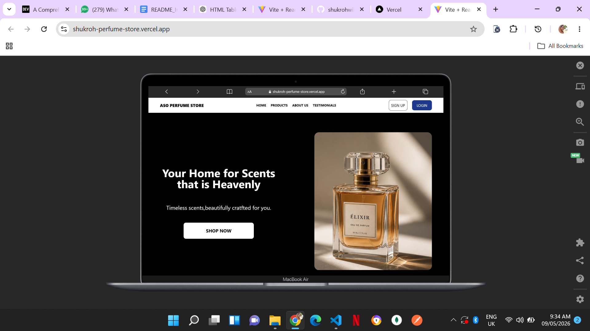
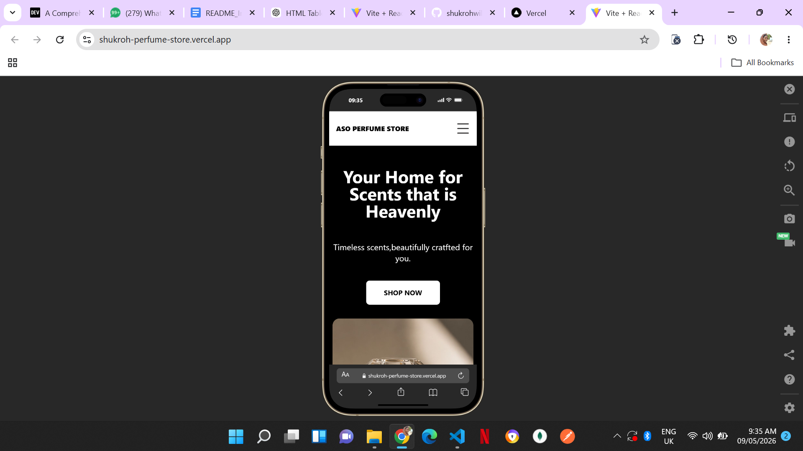

## Project Overview

ASO PERFUME STORE is a responsive e-commerce website built for showcasing and browsing different fragrance products such as perfumes, body mists, perfume oils, and deodorants.

The project focuses on clean UI design, responsiveness, and a smooth shopping experience across desktop and mobile devices.

## Tech Stack

React
TypeScript
Tailwind CSS
Vite
Lucide Icons

## Setup Instructions

To run this project locally:

1. Clone the repository
   git clone https://github.com/shukrohwillalwayscode/Shukroh-perfume-store.git
2. Navigate into the project
   cd Shukroh-perfume-store
3. Install dependencies
   npm install
4. Start development server
   npm run dev

## Screenshots

### Desktop view

### Tablet view

### Mobile View

## Key Decisions

Used Vite for fast development and optimized builds
Chose Tailwind CSS for rapid and responsive UI design
Structured components for reusability (Hero, Products, Reviews, Footer)
Focused on mobile-first responsive design using Tailwind breakpoints
Used static assets for product images to improve performance

## Deployment

Hosted on Vercel
Live URL: https://shukroh-perfume-store.vercel.app/
